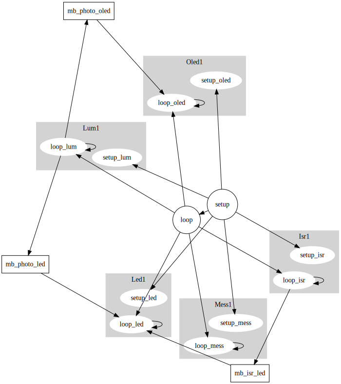

# TP4 DAUVET CHEN

## Installation ESP32 / Arduino

Après avoir installé les librairies ESP32, on sélectionne dans l'IDE arduino notre carte **Tools -> Boards -> TTGO-Lora-OLED V1** avec le port USB où on a connecté notre ESP32 (en ayant pris soin d'accordé les droits total sur ce port: `sudo chmod -R 777/dev/ttyUSB0`), puis lançons notre premier programme Arduino: **File -> Exemples -> 0.1 Basics -> Blink**

Ce programme permet de faire clignotter la LED intégré à l'ESP32 à une fréquence d'in clignottement par seconde.

* La fonction `setup()` est éxécuté lorsqu'on branche l'ESP cela correspond à l'initialisation. Dans cette fonction on indique à l'ESP que la LED intégré va être utiliser en mode sortie.
* La fonction `loop()` est a boucle pricipale de notre programme. On appelle la fonction `digitalWrite(pin, val)` pour allumer ou éteindre la LED et `delay(ms)` pour attendre. 

## Exécution multi-tâches

### Tâches standards

Une tache est une structure de données représentant des actions à effectué dans notre application, ses actions sont initialisées par la fonction `setup_Tache()` appelé dans `setup()` avec certains paramètre `params`, et leurs code est éxécutées dans la fonction `loop_Tache()` appelé dans la fontion `loop()` avec des pointeurs `connectors` utilisées pour la communications inter-tâches.

```C
void setup_Tache(struct Tache_s *ctx, params...) {
   // Initialisation du contexte}
   ctx->etat = etat_initial;  //  reçu dans les paramètres
   ...
}
```C
void loop_Tache(tache_t *ctx, connectors...) {   
   // test de la condition d'exécution, si absent on SORT
   if (evement_attendu_absent) return;
   // code de la tache
   ...
}
```

Pour éxécuté une tâche, on a besoin de sauvegarder son contexte d'éxécution (où on en est dans l'action), dans une variable globale, la structure d'une tâche contient donc son `etat` et la valeurs de ses *variables* :

```C
struct Tache_s {
  unsigned int etat;  
  int config;        
}; 
```

En effet, si on déclarait ces *variables* dans `loop_Tache()` ou `setup_Tache()`, ces variables ne serait pas conservé entre deux appelles de ces fonctions. On aurait aussi pu déclaré les *variables* comme **static** dans ces fonctions (valeurs conservé entre deux appelles), mais cela pause deux problèmes :

1. On ne peut pas déclaré de variable **static** dans setup, cela produit une erreur de compilation.
2. Une variable static est locales à une fonction, donc l'éxécutions de la même fontion par plusieurs tâches n'est pas possible.

Donc la strcture pour sauvegarder le contexte d'une tâche reste la meilleur option.

### Questions

* Que contient le tableau waitForTimer[] et à quoi sert-il ?

    Ce tableau contient pour chaque timer, le temps restant à attendre, il est mis à jour a chaque fois que l'on dépasse la periode.

* Si on a deux tâches indépendantes avec la même période, pourquoi ne peut-on pas utiliser le même timer dans `waitFor()` ?

    Normalement les tâches indépendantes ont des périodes d'exécution différentes, dans ce cas, on ne pourrait pas savoir laquelle des tâches qui a le même timer à été éxécutées.

* Dans quel cas la fonction `waitFor()` peut rendre 2 ?

    2 serait le nombre de periode depuis le dernier appelle de `waiFor()` sur ce timer.

## Utilisation de l'écran OLED

On va utiliser la fonction `display.sprintln(F())` qui est déjà fournis dans le template dans la fonction `testScrollText()` .On aurai aussi pu utiliser la suite de fonction décrites dans `testDrawChar()`

### Questions

On déplace la fonction `waitFor()` dans un header **timer.h**, on créé un header **oled.h** qui contient les fonctions de l'éran ainsi que la structure de la tâche Oled (et ses fonctions setup et loop), et on modifie notre programme principale.
La nouvelle tâche affiche et enlève le mot "Test" de l'écran.

## Communications inter-tâches

On ajoute à notre sketch un fichier header **flag.h** qui contient la structure de donnée pour la mailbox.

la mailbox à un état `state` aussi appelé flag, qui permet de signaler entre plusieurs tâches qu'on a mis à jour `val` : la variable partagé entre plusieurs tâches.

### Questions

* Dans le texte précédent, quel est le nom de la boîte à lettre et comment est-elle initialisée ?
  
    la boite à lettre instancié est `mb`, elle est initialisé vide

On créé alors un header **lum.h** pour la gestion de la tâche de la photo-résistance et on modifie simplement les fonctions `loop_oled()` et `loop_Led()`: on ajoute en argument un pointeur à la structure mailbox et on change le comportement des fonctions pour qu'elles attendent/placent le verrou sur la variable partagée.

```C
void loop_lum(Lum_s * ctx,mailbox_s * mb_oled ,mailbox_s * mb_led) {
  if (!waitFor(ctx->timer,ctx->period)) return; // sort si moins d'une periode d'attente

  ctx->val = analogRead(PHOTO_PIN);

  if (mb_oled->state == EMPTY); // attend que la mailbox oled soit vide
  {
    mb_oled->val = map(ctx->val,0,PHOTO_MAX,0,100);
    mb_oled->state = FULL;
  }
  if (mb_led->state == EMPTY); // attend que la mailbox led soit vide
  {
    mb_led->val = map(ctx->val,0,PHOTO_MAX,1,500000); //inversement proportionnel à la luminosité
    mb_led->state = FULL;
  }
}
```

```C
void loop_oled(struct Oled_s * ctx,mailbox_s * mb) {
  if (!waitFor(ctx->timer,ctx->period)) return;         // sort s'il y a moins d'une'période écoulée
  if (mb->state != FULL) return;                        // sort si flag pas mis à jour

  display.clearDisplay();
  display.setCursor(10, 0);
  display.printf("%d %s\n",mb->val,F("%"));
  display.display();
  
  mb->state = EMPTY;
}
```C
void setup_Led( struct Led_s * ctx, int timer, unsigned long period, byte pin) {
  while(!Serial);
  ctx->timer = timer;
  ctx->period = period;
  ctx->pin = pin;
  ctx->etat = 0;
  pinMode(pin,OUTPUT);
  digitalWrite(pin, ctx->etat);
}

void loop_Led( struct Led_s * ctx,mailbox_s * mb) {
  if (!waitFor(ctx->timer, ctx->period)) return;          // sort s'il y a moins d'une période écoulée
  
  digitalWrite(ctx->pin,ctx->etat);                       // ecriture
  ctx->etat = 1 - ctx->etat;                              // changement d'état
  // Serial.println(ctx->period);            

  if (mb->state == FULL)                       // pour ne pas être bridé à la periode de la tache lum 
  {
      ctx->period = mb->val;                   // changement de la periode
      mb->state = EMPTY;
  }
}
```

et dans notre programme principale on instancie deux mailbox `mb_photo_oled` et `mb_photo_led`

## Gestions des interruptions

Il existe un autre moyen pour lever des signaux sur Arduino, c'est les routines d'interruption.

### Questions

Le comportement souhaité était le suivant :
On position un handler d'interruption sur le pin d'interruption.
On à une tâche isr qui regarde constament l'état du port série, si le caractère lu est "s", on écrit sur le pin d'interruption la valeur LOW qui déclenche alors le handler, ce signal déclenche une interruption qui stopera la Led qui clignotte.

Le comportement observé  est que le pin 2 est en fait relié à la LED intégré, donc le handler se déclenche à chaque clignottement, pour le pin 3 ca ne marche pas.

En revanche l'interruption du clignottement fonctionne comme prévu.



## Tout ensemble

buzzer.h avec pwm
bouton bp